# CRM flows (Phase 1)

> Generated from one source together with the shareable page. Diagrams are Mermaid: they render on GitHub and in VS Code.

How the CRM is built and how it behaves: the architecture (apps, modules, request path, tenancy, data), who can do what, exactly what happens step by step when someone submits an enquiry, signs in, assigns a lead or changes its status, and how to debug any of it from a request id down to the line of code. Every flow is the same for every tenant; a tenant only changes data (settings, roles, branches), never the flow.

## Legend

- **Rounded box**: where a flow starts or ends
- **Rectangle**: a step the system performs
- **Diamond**: a decision or check
- **Dotted arrow**: happens later, in the background, after the database commit
- **Circle**: an actor (a person) in use-case diagrams
- **Stadium**: a use case (something an actor can do)
- **Sequence diagram**: messages between parts of the system, top to bottom in time

## Contents

- **Architecture**
  - [System at a glance](#architecture)
  - [Backend modules and how they talk](#arch-modules)
  - [The path of one API request](#arch-pipeline)
  - [How tenants are kept apart](#arch-tenancy)
  - [Data model](#arch-data)
  - [One website enquiry, end to end](#arch-sequence)
  - [The two front-end apps](#arch-frontends)
  - [Onboarding a new business (tenant)](#tenant-onboarding)
- **Use cases**
  - [Use cases: capturing leads](#uc-capture)
  - [Use cases: working leads](#uc-handling)
  - [Use cases: administration](#uc-admin)
- **Flows**
  - [The customer journey: enquiry, lead, student](#flow-journey)
  - [Submitting an enquiry](#flow-enquiry)
  - [Staff adding a walk-in or phone lead](#flow-walkin)
  - [Notifications after a new lead](#flow-notify)
  - [Keeping the student informed, and repeat enquiries](#flow-student-updates)
  - [Signing in](#flow-signin)
  - [Every staff request (the common pipeline)](#flow-request)
  - [Which leads a user can see (data scope)](#flow-scope)
  - [Assigning a lead to a counsellor](#flow-assign)
  - [Onboarding a business (SoftZenith console)](#flow-onboarding)
  - [Changing status, closing and reopening](#flow-status)
  - [Lead status lifecycle](#state-lead)
  - [Converting a lead to a student (planned, S1)](#flow-convert)
  - [Lead dashboard](#flow-dashboard)
  - [Onboarding a staff member](#flow-staff)
  - [Staff account lifecycle](#state-staff)
- **Debugging**
  - [Tracing a problem from a request id](#dbg-trace)
  - [What each error code means](#dbg-status)
  - [Runbook: symptom, cause, fix](#dbg-runbook)
  - [Where the code is for each feature](#dbg-codemap)
  - [Running it locally](#dbg-run)
  - [Settings that change behaviour](#dbg-config)
  - [Useful database queries](#dbg-sql)
  - [Who can do what](#permissions)

## Architecture

<a id="architecture"></a>
### System at a glance

Three web apps and one API. Staff use the CRM app; the public uses the CRM's own enquiry page or a tenant's website (Western World runs on its own domain). Browsers never call the API directly: each Next.js server forwards `/api` calls to it, and the Western World site forwards only the two public enquiry endpoints. The API is one Spring Boot application split into modules, over one PostgreSQL schema where every tenant row carries `tenant_id`.

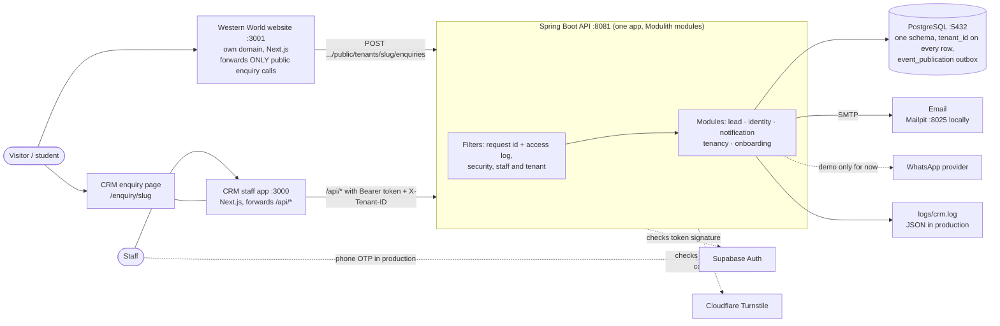

*Where in the code:* `frontend/next.config.ts · westernworld-website repo: next.config.ts · backend/src/main/java/com/softzenith/crm/*`

<a id="arch-modules"></a>
### Backend modules and how they talk

Each folder under `com.softzenith.crm` is a module that owns its tables. A module may call another module's public classes (solid arrows) but never its repositories; `ModularityTests` fails the build if that rule is broken. The lead module never calls notification: it publishes events, which are stored with the lead in the same transaction and delivered after commit (dotted arrow). `shared` is open to every module.

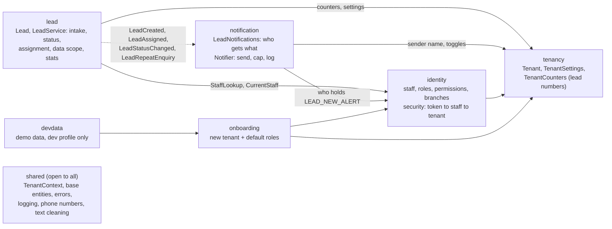

*Where in the code:* `backend/src/main/java/com/softzenith/crm/*/package-info.java · src/test/.../ModularityTests.java`

<a id="arch-pipeline"></a>
### The path of one API request

The same fixed order for every call. The first filter gives the request an id, which appears on every log line and in every error body, and follows the work into the background notification thread. Anything that goes wrong becomes an RFC 9457 problem response in one place, `GlobalExceptionHandler`.

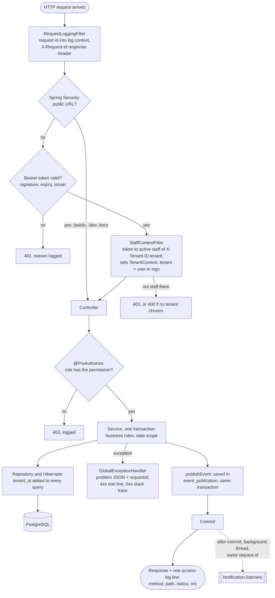

*Where in the code:* `shared/logging/RequestLoggingFilter · identity/security/SecurityConfig · identity/security/StaffContextFilter · shared/web/GlobalExceptionHandler`

<a id="arch-tenancy"></a>
### How tenants are kept apart

Tenant isolation does not rely on developers remembering a where-clause. Whoever handles the work puts the tenant in `TenantContext` (a per-thread value); Hibernate reads it and stamps or filters `tenant_id` on every entity that extends `TenantScopedEntity`. If nothing set it, queries return nothing and inserts fail.

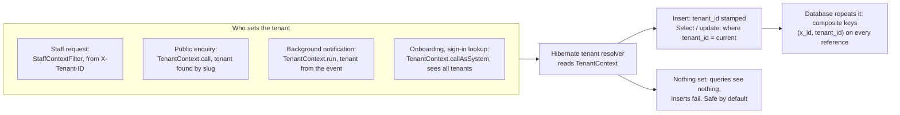

*Where in the code:* `shared/tenant/TenantContext · shared/tenant/HibernateTenancyConfig · shared/persistence/TenantScopedEntity`

<a id="arch-data"></a>
### Data model

Tables as the Flyway migrations V1 to V7 create them (V7 only changes the seeded roles' data scope; the planned Student table is described under 'Converting a lead to a student') (`ddl-auto=validate`: the app refuses to start if an entity and the schema disagree). Tables owned by a tenant also carry `tenant_id`, audit columns (`created_at/by`, `updated_at/by`) and `version` for optimistic locking. One open lead per person: unique on (tenant, phone, email) while the lead is not CLOSED.

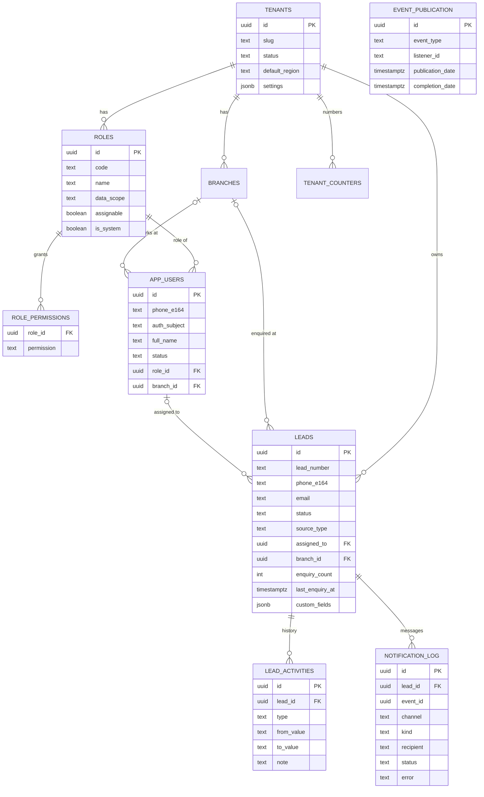

*Where in the code:* `backend/src/main/resources/db/migration/V1..V7 · */*.java entities`

<a id="arch-sequence"></a>
### One website enquiry, end to end

What happens between a visitor pressing Submit on the Western World site and the emails going out. The visitor gets the thank-you as soon as the database commits; messages follow on a background thread carrying the same request id, so the whole story can be read back from the log.

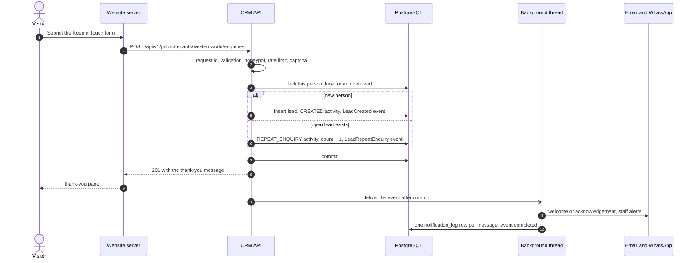

*Where in the code:* `westernworld-website repo: components/EnquiryForm.tsx, lib/enquiry.ts · lead/web/PublicEnquiryController · lead/LeadService.intake · notification/*`

<a id="arch-frontends"></a>
### The two front-end apps

Both are Next.js 16 apps with client-side pages. The staff app builds its menu from the signed-in user's permissions and calls the API through a client whose types are generated from the backend's OpenAPI spec (`npm run gen:api`). Tenant websites live in their own repositories (Western World: `codewithnmn/westernworld-website`): content pages, one enquiry form component used everywhere, redirects that keep every old URL working, and the public enquiry API as their only link to the CRM.

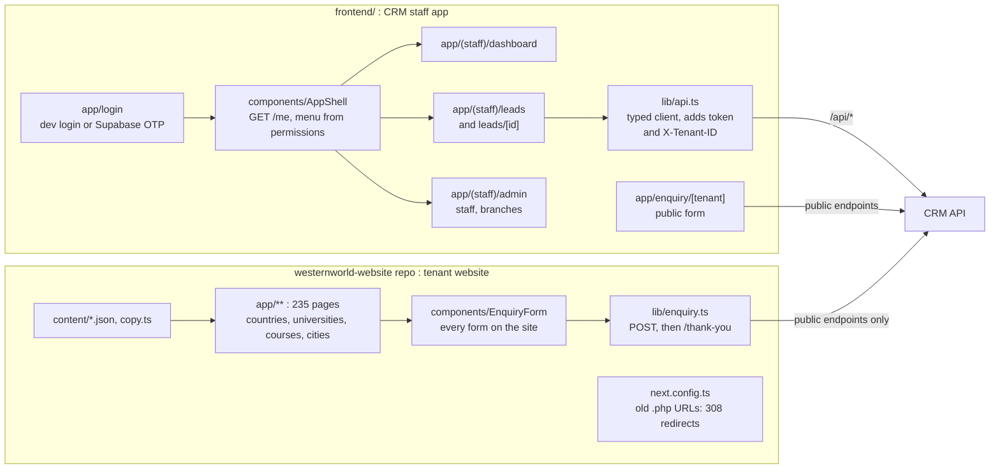

*Where in the code:* `frontend/app/* · frontend/components/AppShell.tsx · frontend/lib/api.ts · westernworld-website repo: app/*, content/*`

<a id="tenant-onboarding"></a>
### Onboarding a new business (tenant)

The golden rule: a new business needs data, not code. Onboarding creates the tenant and its default roles in one transaction; everything that differs between businesses is stored as tenant settings. Settings and tenant creation have no admin screen yet (planned); today they are done by the seeder or directly.

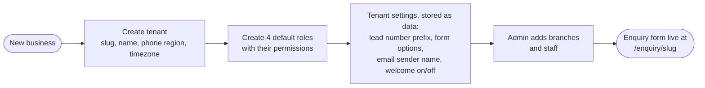

*Where in the code:* `onboarding/TenantOnboardingService.java · tenancy/TenantSettings.java · identity/DefaultRoles.java`

## Use cases

<a id="uc-capture"></a>
### Use cases: capturing leads

Leads come in from the public form or are entered by staff. Both go through the same intake, so duplicate detection, numbering and notifications are identical.

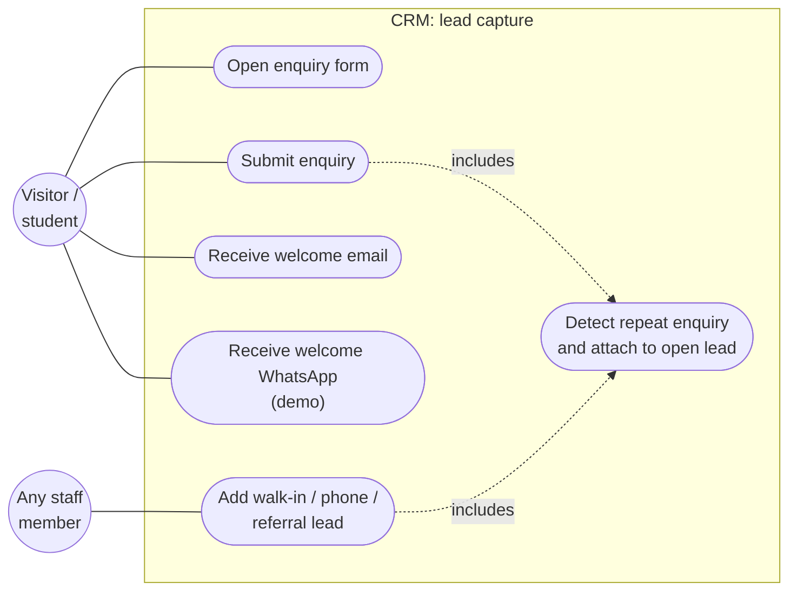

*Where in the code:* `lead/web/PublicEnquiryController.java · lead/web/LeadController.java · lead/LeadService.intake`

<a id="uc-handling"></a>
### Use cases: working leads

What a role sees follows its data scope: Admin and Receptionist ALL, Branch Manager BRANCH (own branch + assigned to them), Counsellor OWN (assigned to them); other leads answer 404. A lead a counsellor adds stays unassigned until reception or an admin assigns it. Receptionists and admins assign; admins and counsellors change status; only admins reopen and see the dashboard. Every action is written to the lead's history, and the student is told (email + WhatsApp) when the lead is assigned or its status changes. Planned (S1, not built yet): the counsellor converts a qualified lead into a Student, and the follow-up work moves there.

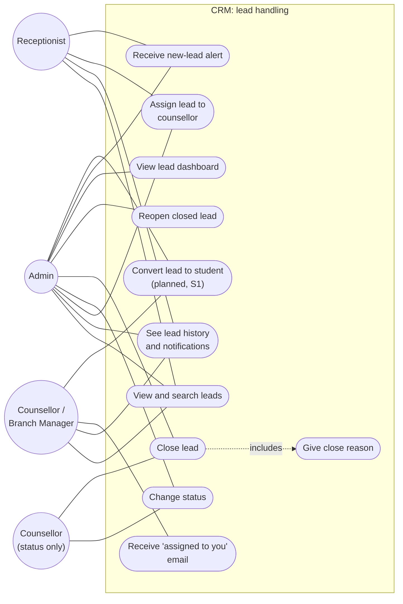

*Where in the code:* `lead/web/LeadController.java · lead/LeadService.java · notification/LeadNotifications.java`

<a id="uc-admin"></a>
### Use cases: administration

Admins onboard staff by mobile number and keep basic employee records. The staff member activates their own account by signing in with that number.

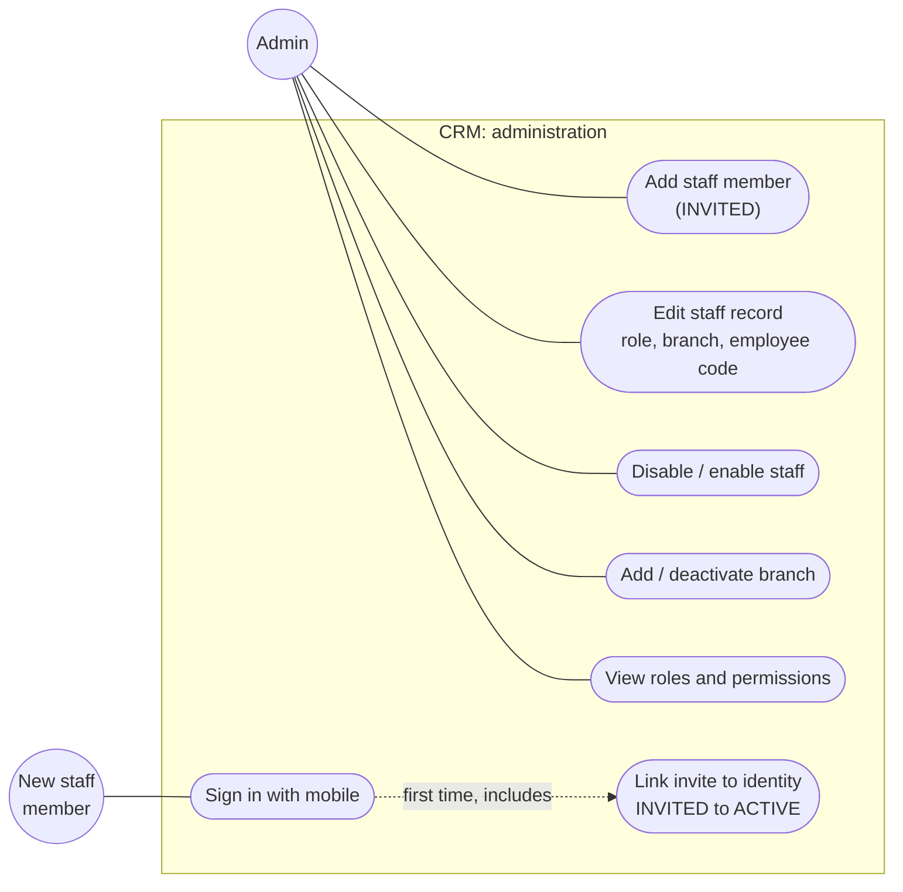

*Where in the code:* `identity/web/StaffController.java · identity/web/OrganisationController.java · identity/StaffDirectory.java`

## Flows

<a id="flow-journey"></a>
### The customer journey: enquiry, lead, student

The big picture. A Lead is an enquiry that is not yet qualified; it is assigned to a counsellor, who contacts and qualifies it. A lead ends in one of two ways: it is converted into a Student when the person decides to go ahead, or it is closed as lost, with a reason. Assignment does not end a lead. From conversion on, all the real work (follow-ups, tasks, remarks, documents, applications, the visa case) belongs to the Student. Student is the Western World name for a generic Contact, so other businesses can call it Client or Customer. Dashed boxes are planned: Student and conversion (S1), then remarks and tasks (C1 to C3), documents (DOC1, DOC2), and applications and visa (PRD phase 4).

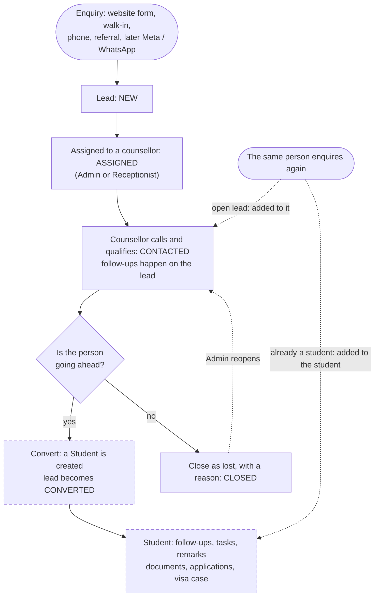

*Where in the code:* `lead/LeadService.java (today) · roadmap S1, C1 to C3, DOC1 and DOC2 in HANDOFF.md`

<a id="flow-enquiry"></a>
### Submitting an enquiry

Everything up to "Commit" happens in one database transaction on the request thread. The lead and the "notify about it" event are saved together, or not at all. Notifications run afterwards (next diagram), so the visitor never waits for email.

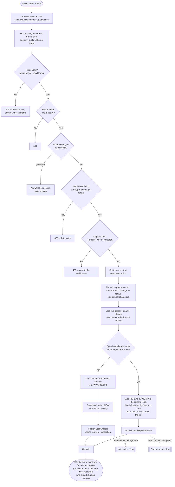

*Where in the code:* `frontend/app/enquiry/[tenant]/page.tsx · lead/web/PublicEnquiryController.submit · lead/LeadService.intake · tenancy/TenantCounters.next`

<a id="flow-walkin"></a>
### Staff adding a walk-in or phone lead

Same intake as the public form. The only differences: the tenant comes from the signed-in user, the source is chosen by staff, and created_by records who entered it.

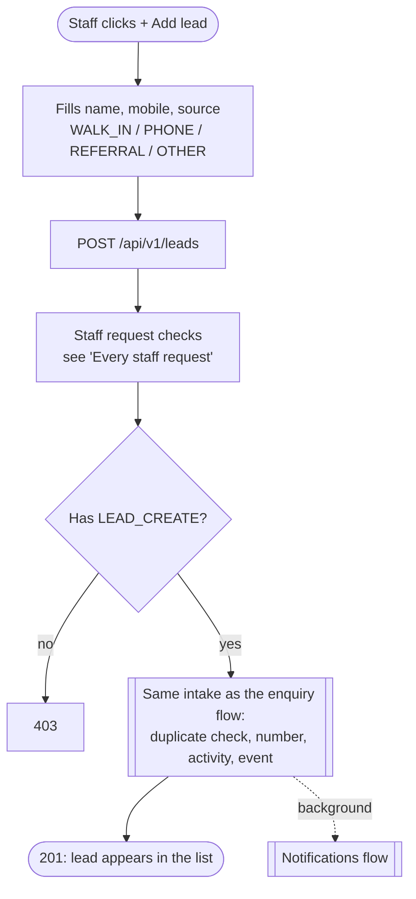

*Where in the code:* `frontend/app/(staff)/leads/page.tsx (AddLead) · lead/web/LeadController.create`

<a id="flow-notify"></a>
### Notifications after a new lead

Runs on a background thread once the lead is committed. One failed recipient never stops the others. Every attempt, whatever the result, is written to notification_log and shown on the lead page. If the app crashes halfway, the event is re-sent on the next start; messages already delivered for that event are skipped. The enquirer's welcome only repeats service/country values from the tenant's form options, and at most enquirer-daily-cap messages of one kind go to one address per day (the rest are logged SKIPPED). Completed events are deleted from event_publication.

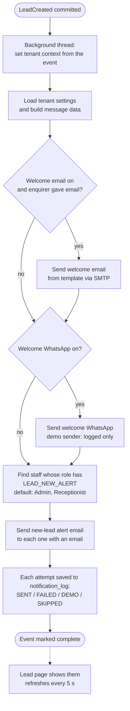

*Where in the code:* `notification/LeadNotifications.java · notification/Notifier.java · resources/templates/notifications/*.mustache`

<a id="flow-student-updates"></a>
### Keeping the student informed, and repeat enquiries

Messages to the enquirer after the welcome, all following the tenant setting notifications.studentUpdates (default on). Staff wording is never forwarded: the close reason stays internal. A repeat enquiry alerts the counsellor who owns the lead, or the new-lead alert staff when nobody does. (Feed @mentions of the student arrive with the Phase 3 feed.)

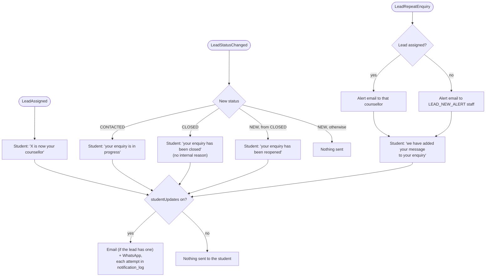

*Where in the code:* `notification/LeadNotifications.java · resources/templates/notifications/lead-status-*, repeat-enquiry-*`

<a id="flow-signin"></a>
### Signing in

Production uses Supabase phone OTP; development uses a backend dev login with no OTP. Both give a token with the same shape, so everything after that is identical. A sign-in proven by an OTP (token amr) links every open invite for that phone, also on later sign-ins (e.g. a second business invites the same person). Dev login refuses to start with the prod profile.

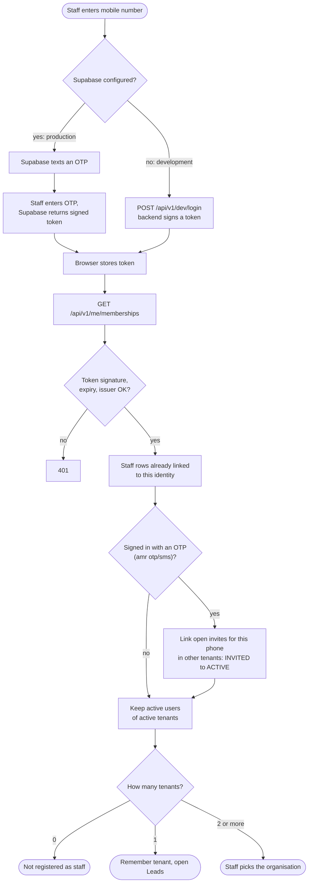

*Where in the code:* `frontend/app/login/page.tsx · identity/security/DevLoginController.java · identity/StaffDirectory.memberships`

<a id="flow-request"></a>
### Every staff request (the common pipeline)

Every screen after sign-in goes through these checks. Role and permissions are read from the database on each request, so a role change applies immediately. The tenant filter means a query can never return another business's data, even if code forgets to check.

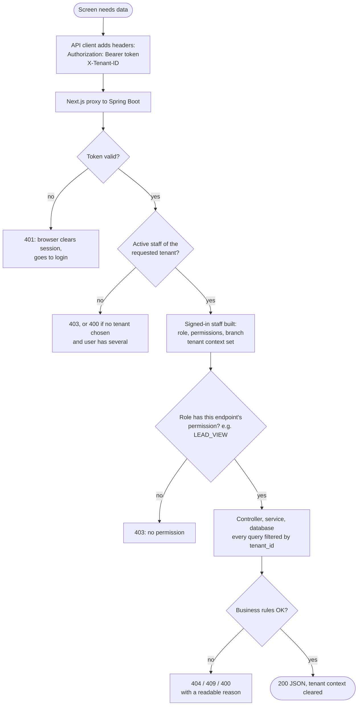

*Where in the code:* `frontend/lib/api.ts · identity/security/SecurityConfig.java · identity/security/StaffContextFilter.java · shared/tenant/*`

<a id="flow-scope"></a>
### Which leads a user can see (data scope)

Each role has a data scope. The lead list is filtered by it, and every action that loads one lead (open, edit, status, assign, history, messages) uses the same check, answering 404 so a user cannot even learn that a lead outside their scope exists. Seeded roles (owner, 26 Sep 2026; V7): Admin and Receptionist ALL, Branch Manager BRANCH, Counsellor OWN; a tenant changes them in roles.data_scope. A new enquiry is always recorded whatever the scope of the staff member entering it; a lead a counsellor adds stays unassigned until reception or an admin assigns it.

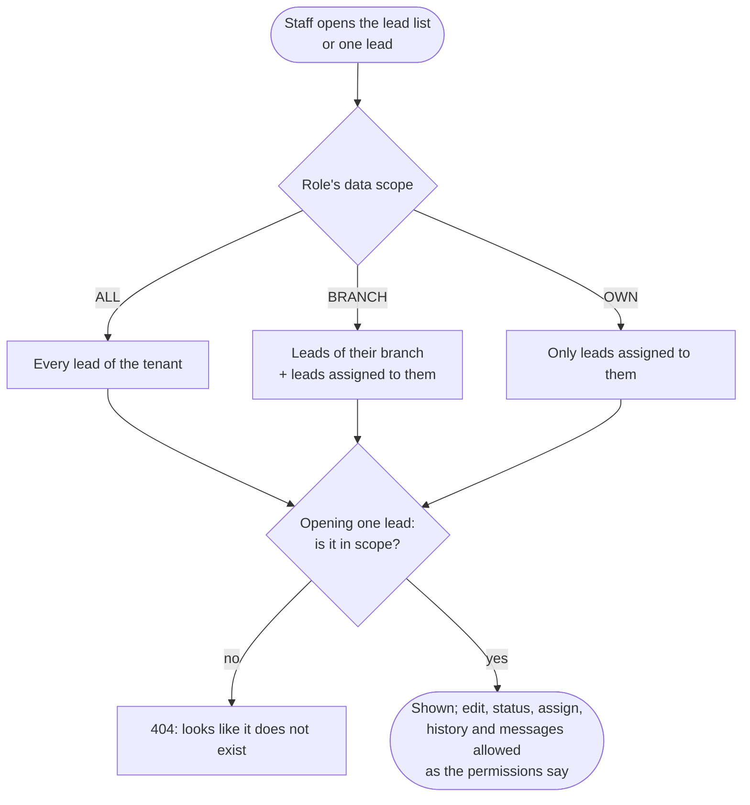

*Where in the code:* `lead/LeadService.scopeSpecification · lead/LeadService.inScope · identity/DataScope · identity/Role`

<a id="flow-assign"></a>
### Assigning a lead to a counsellor

Admins and receptionists can assign (LEAD_ASSIGN). Only staff whose role is marked assignable appear in the list (by default Counsellor and Branch Manager; the dev demo tenant also made its Super Admin assignable, as tenant data). Reassigning works the same way and keeps the history. Assignment does not end the lead: the counsellor works it until it is converted to a student or closed as lost.

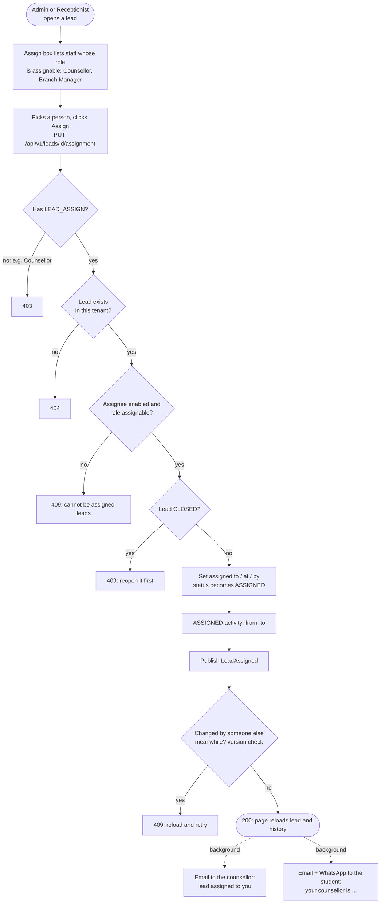

*Where in the code:* `frontend/app/(staff)/leads/[id]/page.tsx (Assign) · lead/LeadService.assign · lead/Lead.assignTo`

<a id="flow-onboarding"></a>
### Onboarding a business (SoftZenith console)

A SoftZenith platform admin signs in at /platform with a username and password (a separate identity from tenant staff, with its own token and filter chain) and fills in the onboarding form. The preview runs the whole setup in a transaction and rolls it back, so a ready preview will go live. Going live creates everything in one transaction. Runbook: docs/onboarding.md.

```mermaid
flowchart TD
  A(["Platform admin opens /platform"]) --> B["POST /api/platform/auth/login"]
  B --> C{"Username + password OK?<br/>not locked, under attempt limit"}
  C -- no --> C1["401 same message for every refusal<br/>(5 failures lock 15 min; 10 tries / 10 min / address → 429)"]
  C -- yes --> D["Platform token (4 h), audit LOGIN"]
  D --> E["Wizard: business, enquiry form & messages,<br/>branches, staff (typed, pasted or loaded from file)"]
  E --> F["POST /api/platform/tenants/preview"]
  F --> G{"Blueprint valid?<br/>slug free, an Admin, phones, roles, branches"}
  G -- no --> G1["Problems per field → shown on their step"]
  G1 --> E
  G -- yes --> H["Trial run in a transaction, then rolled back"]
  H --> I["Summary: first lead number, form address, staff"]
  I --> J["POST /api/platform/tenants (Go live)"]
  J --> K["One transaction, system context: tenant + settings,<br/>4 default roles, branches, staff INVITED"]
  K --> L["Audit TENANT_ONBOARDED"]
  L --> M(["Live: /enquiry/slug takes enquiries;<br/>staff activate on first phone sign-in"])
```

*Where in the code:* `frontend/components/platform/OnboardingWizard.tsx · platform/web/PlatformController · onboarding/TenantOnboardingService · onboarding/BlueprintValidator · identity/OrganisationProvisioner`

<a id="flow-status"></a>
### Changing status, closing and reopening

Admins and counsellors change status (LEAD_CHANGE_STATUS). ASSIGNED is never set here (use Assign). Closing means the enquiry is lost (not interested, unreachable, ...) and needs a reason; reopening a closed lead needs LEAD_REOPEN, and a reopened lead goes back to the unassigned queue (its counsellor is cleared, recorded as an UNASSIGNED activity) for reception to reassign. A lead that goes ahead is not closed but converted to a student (planned, S1). The database repeats the key rules as constraints, as a last safety net.

```mermaid
flowchart TD
  A(["Admin or counsellor picks a new status"]) --> B["POST /api/v1/leads/id/status"]
  B --> C{"Has LEAD_CHANGE_STATUS?"}
  C -- no --> C1["403"]
  C -- yes --> D{"Lead currently CLOSED?"}
  D -- yes --> D1{"Has LEAD_REOPEN?"}
  D1 -- no --> C1
  D1 -- yes --> J{"Another open lead for<br/>the same person?"}
  J -- yes --> J1["409: names that lead"]
  J -- no --> E
  D -- no --> E{"Target status"}
  E -- "same as now" --> E0["409: already in that status"]
  E -- ASSIGNED --> E1["409: use Assign instead"]
  E -- CLOSED --> F{"Reason given?"}
  F -- no --> F1["400: reason required"]
  F -- yes --> G["Save reason and closed time"]
  E -- "NEW or CONTACTED" --> H["Clear close reason and time;<br/>if reopening, clear the counsellor"]
  G --> I["STATUS_CHANGED activity<br/>(+ UNASSIGNED on reopen)"]
  H --> I
  I --> K(["200: status updated"])
  K -.->|"background"| L[["Student-update flow:<br/>email + WhatsApp, no close reason"]]
```

*Where in the code:* `frontend/app/(staff)/leads/[id]/page.tsx (ChangeStatus) · lead/LeadService.changeStatus · lead/Lead.changeStatus`

<a id="state-lead"></a>
### Lead status lifecycle

The statuses from the PRD and who can move a lead between them. A lead has two endings: CLOSED (lost, with a reason; an admin can reopen it) and CONVERTED (went ahead and became a student; final). CONVERTED is planned (S1, not built yet).

```mermaid
stateDiagram-v2
  [*] --> NEW: enquiry or staff entry
  NEW --> CONTACTED: Admin or Counsellor
  CONTACTED --> NEW: Admin or Counsellor
  NEW --> ASSIGNED: Admin or Receptionist assigns
  CONTACTED --> ASSIGNED: Admin or Receptionist assigns
  ASSIGNED --> ASSIGNED: reassign
  ASSIGNED --> CONTACTED: Admin or Counsellor
  ASSIGNED --> NEW: Admin or Counsellor
  NEW --> CLOSED: Admin or Counsellor, reason required
  CONTACTED --> CLOSED: Admin or Counsellor, reason required
  ASSIGNED --> CLOSED: Admin or Counsellor, reason required
  CLOSED --> NEW: Admin reopens (unassigned)
  CLOSED --> CONTACTED: Admin reopens (unassigned)
  ASSIGNED --> CONVERTED: counsellor converts (planned, S1)
  CONTACTED --> CONVERTED: counsellor converts (planned, S1)
  CONVERTED --> [*]: work continues on the Student
```

*Where in the code:* `lead/LeadStatus.java · lead/Lead.java`

<a id="flow-convert"></a>
### Converting a lead to a student (planned, S1)

Not built yet: this is the design proposed to the owner. The counsellor working a lead converts it when the person decides to go ahead. The Student keeps a link to the lead, so the enquiry history stays visible on the student's page. Students follow the same data scope as leads: a counsellor sees their own students, a branch manager the branch's students, and an admin all of them. Still to confirm with the owner: who may convert (proposed: a new LEAD_CONVERT permission for Admin, Branch Manager and Counsellor), the student number format, and the wording of any message to the student.

```mermaid
flowchart TD
  A(["Counsellor, Branch Manager or Admin<br/>opens a lead, clicks Convert to student"]) --> B["POST /api/v1/leads/id/conversion"]
  B --> C{"Has LEAD_CONVERT?"}
  C -- no --> C1["403"]
  C -- yes --> D{"Lead within the user's<br/>data scope?"}
  D -- no --> D1["404"]
  D -- yes --> E{"Lead status"}
  E -- CLOSED --> E1["409: reopen it first"]
  E -- CONVERTED --> E2["409: already a student,<br/>link to the student"]
  E -- "NEW, no counsellor" --> E3["409: assign a counsellor first"]
  E -- "ASSIGNED or CONTACTED" --> F{"A student with this<br/>phone + email already exists?"}
  F -- "yes: returning student" --> F1["Link the lead to that student"]
  F -- no --> G["Create the Student: next student number,<br/>name, phone, email, branch, counsellor,<br/>custom fields, link to the lead"]
  F1 --> H["Lead becomes CONVERTED<br/>+ CONVERTED activity in its history"]
  G --> H
  H --> I["Publish LeadConverted"]
  I --> J(["The student's profile opens,<br/>with the lead history on it"])
  I -.->|"background"| K["Messages to the counsellor / student<br/>(wording to be confirmed by the owner)"]
```

**Planned Student record (generic Contact)**

| Field | Filled from | Why |
|---|---|---|
| student number | a new per-tenant counter, e.g. WWV-S-000001 | human-readable reference, like lead numbers |
| name, phone, email | the lead | the phone is the person's identity; unique per tenant with the email |
| branch | the lead's branch | drives BRANCH scope (Branch Manager) |
| counsellor | the lead's assignee | drives OWN scope (Counsellor); can be reassigned later |
| lead | the converted lead | keeps the enquiry history readable |
| journey stage | tenant settings, e.g. Counselling, Applications, Visa, Enrolled | S1's configurable journey stages |
| custom fields | the lead's custom fields | tenant-specific data (JSONB) |

*Where in the code:* `planned: student module · V8 migration · LeadService.convert · POST /api/v1/leads/{id}/conversion`

<a id="flow-dashboard"></a>
### Lead dashboard

Counts leads created in the chosen period, grouped by their current status. Every number links to the lead list with that filter applied.

```mermaid
flowchart TD
  A(["Admin opens Dashboard,<br/>picks a period"]) --> B["GET /api/v1/leads/stats?from=..."]
  B --> C{"Has REPORTS_VIEW?"}
  C -- no --> C1["403"]
  C -- yes --> D["Four grouped counts, tenant-filtered:<br/>by status, by source, by counsellor,<br/>open and unassigned"]
  D --> E["Missing statuses and sources shown as 0,<br/>counsellor ids turned into names"]
  E --> F(["Tiles and tables,<br/>refresh every 30 s"])
  F --> G["Click a number: lead list filtered,<br/>e.g. /leads?status=NEW"]
```

*Where in the code:* `frontend/app/(staff)/dashboard/page.tsx · lead/LeadService.stats · lead/LeadRepository (count queries)`

<a id="flow-staff"></a>
### Onboarding a staff member

The mobile number is the sign-in identity, so it must be unique within the business. Role and branch must belong to the same business; the database enforces this too.

```mermaid
flowchart TD
  A(["Admin: Staff, + Add staff member"]) --> B["POST /api/v1/users<br/>name, mobile, email, role, branch,<br/>employee code, designation, joined on"]
  B --> C{"Has USER_MANAGE?"}
  C -- no --> C1["403"]
  C -- yes --> C2{"Role's permissions all<br/>held by the admin?"}
  C2 -- no --> C3["403: no privilege escalation"]
  C2 -- yes --> D["Normalise mobile<br/>with the tenant's region"]
  D --> E{"Mobile already used<br/>in this tenant?"}
  E -- yes --> E1["409"]
  E -- no --> F{"Role and branch belong<br/>to this tenant?"}
  F -- no --> F1["404"]
  F -- yes --> G["Save staff member: INVITED"]
  G --> H(["They sign in with that mobile:<br/>linked and ACTIVE"])
```

*Where in the code:* `frontend/app/(staff)/admin/staff/page.tsx · identity/StaffAdminService.invite`

<a id="state-staff"></a>
### Staff account lifecycle

A disabled user is refused from their very next request. Nobody can change their own role or disable themselves, or manage a user whose role has permissions they lack.

```mermaid
stateDiagram-v2
  [*] --> INVITED: Admin adds staff
  INVITED --> ACTIVE: first sign-in with that mobile
  INVITED --> DISABLED: Admin disables
  ACTIVE --> DISABLED: Admin disables
  DISABLED --> INVITED: Admin enables, never signed in
  DISABLED --> ACTIVE: Admin enables, signed in before
  ACTIVE --> INVITED: Admin resets sign-in (identity recreated)
```

*Where in the code:* `identity/UserStatus.java · identity/AppUser.java`

## Debugging

<a id="dbg-trace"></a>
### Tracing a problem from a request id

Every response carries an `X-Request-Id` header and every error body a `requestId`. That id is on every log line the request produced, including the background notification lines, so one search tells the whole story. Log lines read `LEVEL [request id|tenant id|user id]`; phones and emails are always masked (`+91******3210`, `a***@mail.com`).

```mermaid
flowchart TD
  A(["Someone reports: it failed"]) --> B["Get the request id: requestId in the error,<br/>or X-Request-Id in browser dev tools, Network tab"]
  B --> C["Search backend/logs/crm.log for it"]
  C --> D{"What do the lines show?"}
  D -- "4xx access line" --> E["The line just before names the reason:<br/>validation, permission, not found or out of scope,<br/>conflict, rate limit"]
  D -- "500 with a stack trace" --> F["A bug: the first 'at com.softzenith...' frame<br/>is the file and line to open"]
  D -- "200 or 201, then notification lines" --> G["Follow the background lines with the same id:<br/>Email ... sent, failed or skipped"]
  D -- "nothing at all" --> H["The request never reached the API:<br/>Next.js server, CRM_API_URL, backend down"]
  G --> I["Cross-check the lead page, Messages sent<br/>(notification_log)"]
```

**What the log lines look like (one website enquiry)**

```
10:30:27.531  INFO [336c2567-51b9|01a0d8f9-...|] [tomcat-handler-1] LeadService  : Lead WWV-000008 created via WEBSITE_FORM [westernworldvisaservices.com: Keep in touch (home)] (phone +91******8827)
10:30:27.600  INFO [336c2567-51b9|01a0d8f9-...|] [tomcat-handler-1] crm.access   : POST /api/v1/public/tenants/westernworld/enquiries -> 201 in 308 ms
10:30:27.637  INFO [336c2567-51b9|01a0d8f9-...|] [task-1]           Notifier     : Email LEAD_WELCOME sent to l***@example.test (lead 01a0dc16-...)
10:30:27.638  INFO [336c2567-51b9|01a0d8f9-...|] [task-1]           Notifier     : WhatsApp LEAD_WELCOME DEMO to +91******8827 via demo-whatsapp (lead ...)
10:30:27.656  INFO [cc2228fe-9574||]             [tomcat-handler-2] SecurityConfig: 401 GET /api/v1/leads: ... Malformed token
                   ^request id  ^tenant ^user     ^thread            ^logger        ^what happened
```

**Searching the log**

```
# Git Bash
grep 336c2567-51b9 backend/logs/crm.log                  # everything for one request
grep WWV-000009 backend/logs/crm.log                     # everything about one lead
grep " ERROR " backend/logs/crm.log | tail -20           # recent errors, with stack traces below them
grep "crm.access" backend/logs/crm.log | grep -- "-> 5"  # server errors

# PowerShell
Select-String -Path backend\logs\crm.log -Pattern "336c2567-51b9"
Get-Content backend\logs\crm.log -Wait -Tail 50        # follow the log live
```

*Where in the code:* `shared/logging/* · backend/logs/crm.log · application.yml (logging) · application-prod.yml (JSON)`

<a id="dbg-status"></a>
### What each error code means

Every error is an RFC 9457 problem JSON with `status`, `detail` and `requestId`. The `detail` text is written for people; the log has the technical reason.

| Status | Means | Typical causes | Where it is produced | What to check |
|---|---|---|---|---|
| 400 Bad Request | The request is wrong | Missing or invalid field (listed in `detail`); name with digits or a URL; closing a lead without a reason; bad or missing `X-Tenant-ID` for a user in several tenants | `GlobalExceptionHandler`, `StaffContextFilter`, entity rules (`Lead.changeStatus`) | `detail` names the field; log line `400 validation failed: ...` |
| 401 Unauthorized | Not signed in | No token, expired or forged token, wrong issuer (Supabase URL) | Spring Security, `SecurityConfig` entry point | Log `401 GET /path: <reason>`; the staff app clears the session and goes to login |
| 403 Forbidden | Signed in but not allowed | Role lacks the endpoint's permission; not active staff of that tenant; captcha failed on the public form; granting a role stronger than your own | `@PreAuthorize`, `StaffContextFilter`, `PublicEnquiryController`, `StaffAdminService` | Log `403 ...` or `Rejected: subject ...`; compare with the permission matrix |
| 404 Not Found | Nothing to show | Wrong id; record of another tenant; lead outside the user's data scope (BRANCH / OWN); unknown tenant slug | `NotFoundException` from services | Scope first: does the user's role have data_scope ALL? |
| 409 Conflict | Clashes with current data | Phone already used by another staff member; assigning a closed lead; someone else saved the record first (version check); database constraint | `ConflictException`, optimistic lock, integrity violation | Log shows the rule or `constraint=<name>`; reload and retry for concurrent edits |
| 429 Too Many Requests | Slow down | Public form: more than 5 a minute or 30 an hour from one IP, 5 an hour for one phone, 1000 an hour per tenant | `EnquiryRateLimiter` | `Retry-After` header; limits in `crm.public-intake.rate-limit.*` |
| 500 Internal Server Error | A bug or an outage | Unhandled exception, database down | `GlobalExceptionHandler.unexpected` | Log ERROR with the full stack trace under the same request id |

*Where in the code:* `shared/web/GlobalExceptionHandler · identity/security/ProblemResponses · identity/security/SecurityConfig`

<a id="dbg-runbook"></a>
### Runbook: symptom, cause, fix

Start from what the person sees. Most answers are in the lead page (history and Messages sent), the log for the request id, or one of the SQL queries below.

| Symptom | Likely cause | How to confirm | Fix |
|---|---|---|---|
| Enquiry submitted but no new lead in the list | Same phone + email already has an open lead, so it was added to that lead as a repeat | Log `Repeat enquiry #n on lead WWV-...`; the older lead has a Repeat badge and sits on top | Nothing to fix: search by phone. Close the old lead to get a new one next time |
| Enquiry submitted but no lead at all | Dropped as a bot (honeypot), refused by rate limit (429) or captcha (403), wrong tenant slug | Log `dropped: honeypot filled`, `429`, `captcha missing or invalid`; the website's `NEXT_PUBLIC_CRM_TENANT` | Correct the slug / captcha keys; wait for the rate limit |
| A lead exists but a user cannot see it | The user's role has data scope BRANCH or OWN | `roles.data_scope` for their role; the lead's branch and assignee | Assign it to them, set the lead's branch, or change the role's scope |
| Website form shows an error, nothing in the CRM log | Website server cannot reach the API | No `crm.access` line for that time; website server output | Set `CRM_API_URL` on the website server; start the backend |
| Welcome email not received | Message FAILED, SKIPPED or never attempted | Lead page, Messages sent: SENT (check spam / Mailpit), FAILED (error shown), SKIPPED (daily cap of 5), none (event still pending) | Fix SMTP settings (`MAIL_*`); pending events are re-sent on restart |
| WhatsApp not received | WhatsApp is demo only | Status DEMO in Messages sent | Expected until the WhatsApp Business API is set up (T7) |
| Staff cannot sign in, 'not registered as staff' | No staff row for that phone in an active tenant, user DISABLED, or the token does not prove an OTP sign-in | `app_users` by `phone_e164`; log `Rejected: subject ...` | Add or enable the staff member; Staff page, Reset sign-in if the identity changed |
| A page shows 'no permission' or a menu item is missing | The role lacks the permission | Permission matrix; `role_permissions` for the role | Grant the permission (DefaultRoles for new tenants + a migration for existing ones) |
| 'Record was modified by someone else' | Two people edited the same lead or staff record | 409 with a version conflict in the log | Reload and apply the change again |
| Same message sent twice | Should not happen: re-delivered events skip messages already logged for that event | `notification_log.event_id` for the lead | Report with the request id; check `NotifierTests` |
| Backend will not start | Postgres not running; a migration changed after it ran (checksum); entity and table disagree (`ddl-auto=validate`); dev login enabled with the prod profile | First ERROR in the console at startup | Start Postgres; never edit an applied migration, add a new V8...; fix the entity or migration |
| Staff app shows type errors or missing fields after an API change | Generated client types are stale | `frontend/lib/api-schema.d.ts` lacks the new field | Run the backend, then `npm run gen:api` in frontend |

<a id="dbg-codemap"></a>
### Where the code is for each feature

Paths are relative to `backend/src/main/java/com/softzenith/crm/` and `frontend/`; website paths are in the `westernworld-website` repo. Tests mirror the backend packages under `backend/src/test/java/...`.

| Feature | Backend | Front end | Tests |
|---|---|---|---|
| Public enquiry intake | `lead/web/PublicEnquiryController`, `EnquiryRateLimiter`, `CaptchaVerifier`, `lead/LeadService.intake`, `lead/NewLead` | `frontend/app/enquiry/[tenant]`; website `components/EnquiryForm.tsx`, `lib/enquiry.ts` | `PublicIntakeSecurityTests`, `LeadFlowTests` |
| Leads: list, detail, edit, status, assignment | `lead/web/LeadController`, `lead/LeadService`, `lead/Lead` (status rules), `LeadFilter`, `LeadRepository` | `app/(staff)/leads`, `leads/[id]`, `components/LeadForm.tsx` | `LeadFlowTests` |
| Data scope (ALL / BRANCH / OWN) | `LeadService.scopeSpecification`, `inScope`; `identity/DataScope`, `Role` | none (the backend decides) | `LeadScopeTests` |
| Notifications | `notification/LeadNotifications` (who gets what), `Notifier` (send, cap, idempotency, log), `MessageTemplates`, `resources/templates/notifications/*.mustache`, `DemoWhatsAppSender` | Lead page, Messages sent | `NotifierTests`, `LeadFlowTests` |
| Sign-in and tenant choice | `identity/security/SecurityConfig`, `JwtClaims`, `StaffContextFilter`, `DevLogin*`; `identity/StaffDirectory` | `app/login`, `lib/auth.ts`, `lib/supabase.ts`, `lib/session.ts` | `MeControllerTests`, `DevLoginTest` |
| Roles and permissions | `identity/Permission`, `DefaultRoles`, `Role`, `RoleProvisioner`; migrations V3 to V5 and V7 (data scopes) | `components/AppShell.tsx` (`NAV`, `can`) | `TenantOnboardingTests` |
| Staff and branches | `identity/StaffAdminService`, `web/StaffController`, `web/OrganisationController` | `app/(staff)/admin/staff`, `admin/branches` | `StaffAdminTests` |
| Dashboard | `LeadService.stats`, `LeadRepository` count queries | `app/(staff)/dashboard` | `LeadFlowTests` |
| Tenants and settings | `tenancy/Tenant`, `TenantSettings`, `TenantCounters`; `onboarding/TenantOnboardingService`; `devdata/DevDataSeeder` | none yet | `TenantOnboardingTests` |
| Multi-tenancy plumbing | `shared/tenant/TenantContext`, `HibernateTenancyConfig`, `shared/persistence/TenantScopedEntity` | none | tenant isolation cases in each test class |
| Errors and logging | `shared/web/GlobalExceptionHandler`, `*Exception`; `shared/logging/*`; `identity/security/ProblemResponses` | `lib/api.ts` (`errorMessage`, 401 handling) | `LoggingTests`, `MaskTest` |
| Events | `lead/LeadEvents`; table `event_publication`; `spring.modulith.events.*` in application.yml | none | `LeadFlowTests` (async assertions) |
| Database schema | `resources/db/migration/V1..V7` | none | every integration test runs the migrations |
| API types for the staff app | springdoc at `/v3/api-docs` (dev only) | `lib/api-schema.d.ts` (generated, do not edit) | `tsc` |
| Website content and URLs | none | `content/*.json`, `content/copy.ts`, `app/**`, `next.config.ts` (proxy, redirects), `app/universities-detail.php/route.ts` | `tsc`, `lint`, `build` |

<a id="dbg-run"></a>
### Running it locally

Start in this order; each needs the one before it. Everything runs without cloud accounts: dev login instead of Supabase, Mailpit instead of a real mailbox, demo WhatsApp. Shortcut from the repo root: `.\dev` (restart all), `.\dev stop [-All]`, `.\dev status`. Dev sign-in phones (mock organisation): 9000000001 Anuj (Super Admin, Rohtak), 9000000002 Naman (Branch Manager, Rohini), 9000000003 Natasha (Counsellor, Rohtak), 9000000004 Front Desk (Receptionist), 9000000005 Deepak (Branch Manager, Bahadurgarh), 9000000006 Indu (Counsellor, Rohini), 9000000007 Priya (Counsellor, Bahadurgarh).

| Service | Port | Start | Check |
|---|---|---|---|
| PostgreSQL | 5432 | `"%LOCALAPPDATA%\Programs\pgsql\bin\pg_ctl" -D "%LOCALAPPDATA%\crm-pgdata" -l "%LOCALAPPDATA%\crm-pgdata\server.log" start` | DB `crm`, user `crm_app` / `crm_app` |
| Mailpit | 1025 SMTP, 8025 inbox | `"%LOCALAPPDATA%\Programs\mailpit\mailpit.exe"` | Every local email lands at http://localhost:8025 |
| Backend API | 8081 | `cd backend && ./mvnw spring-boot:run -Dspring-boot.run.profiles=dev` | http://localhost:8081/actuator/health, Swagger at `/swagger-ui.html`, log in `backend/logs/crm.log` |
| CRM staff app | 3000 | `cd frontend && npm run dev` (or `npm run build` then `npx next start -p 3000`) | http://localhost:3000/login |
| Western World website (own repo) | 3001 | `cd ../westernworld-website && npm run dev -- -p 3001`, or list it in `.dev-sites.json` for `.\dev` | http://localhost:3001 |
| Backend tests | none | `cd backend && ./mvnw test` (embedded Postgres + GreenMail, no Docker) | Must be green before a task is done |

**Stop everything (PowerShell)**

```
# front ends and backend
Get-CimInstance Win32_Process -Filter "Name='node.exe'"  | ? { $_.CommandLine -match 'next' }            | % { Stop-Process -Id $_.ProcessId -Force }
Get-CimInstance Win32_Process -Filter "Name='java.exe'"  | ? { $_.CommandLine -match 'CrmApplication|spring-boot:run' } | % { Stop-Process -Id $_.ProcessId -Force }
# mail and database
Get-Process mailpit -ErrorAction SilentlyContinue | Stop-Process -Force
& "$env:LOCALAPPDATA\Programs\pgsql\bin\pg_ctl.exe" -D "$env:LOCALAPPDATA\crm-pgdata" stop -m fast
```

*Where in the code:* `CLAUDE.md (Commands) · README.md`

<a id="dbg-config"></a>
### Settings that change behaviour

Environment variables for deployment and the `application.yml` keys worth knowing when debugging. Local development needs none of the variables; with the `prod` profile the database and Supabase ones are required.

| Setting | Where | Default | Effect |
|---|---|---|---|
| `DB_URL`, `DB_USER`, `DB_PASSWORD` | backend | local crm / crm_app | Database connection (required in prod) |
| `SUPABASE_URL` | backend | placeholder | Issuer and signing keys of staff sign-in tokens (required in prod) |
| `MAIL_HOST`, `MAIL_PORT`, `MAIL_USERNAME`, `MAIL_PASSWORD`, `MAIL_FROM` | backend | Mailpit on localhost:1025 | Where emails go and who they come from |
| `FRONTEND_URL` | backend | http://localhost:3000 | Links to leads inside staff emails |
| `TURNSTILE_SECRET` | backend | empty (no captcha) | Captcha required on public enquiries when set |
| `LOG_FILE` | backend | logs/crm.log | Log file path (20 MB files, 30 days, 2 GB cap) |
| `crm.public-intake.rate-limit.*` | application.yml | 5/min and 30/h per IP, 5/h per phone, 1000/h per tenant | Public form limits, answered with 429 |
| `crm.notifications.enquirer-daily-cap` | application.yml | 5 | Messages of one kind to one enquirer per 24 h; the rest are logged SKIPPED |
| `logging.level.com.softzenith.crm` | application.yml | info (debug in dev) | More detail; add `logging.level.org.hibernate.SQL=debug` to see SQL |
| `CRM_API_URL` | both front ends | http://localhost:8081 | Where the Next.js server forwards API calls |
| `NEXT_PUBLIC_SUPABASE_URL`, `NEXT_PUBLIC_SUPABASE_ANON_KEY` | staff app | empty (dev login) | Phone OTP sign-in |
| `NEXT_PUBLIC_CRM_TENANT` | website | westernworld | Tenant that receives the website's enquiries |
| `NEXT_PUBLIC_TURNSTILE_SITE_KEY` | both front ends | empty | Shows the captcha widget on enquiry forms |

*Where in the code:* `backend/.env.example · frontend/.env.example · backend/src/main/resources/application*.yml`

<a id="dbg-sql"></a>
### Useful database queries

Run in psql or any SQL client against the `crm` database. Direct SQL is not tenant-filtered, so these see every tenant: filter by `tenant_id` when it matters. Read only; change data through the app so history and events stay correct.

```
-- A lead, its history and every message sent for it
select id, lead_number, status, enquiry_count, last_enquiry_at, assigned_to, branch_id
  from leads where lead_number = 'WWV-000009';
select created_at, type, from_value, to_value, note
  from lead_activities where lead_id = (select id from leads where lead_number = 'WWV-000009') order by created_at;
select created_at, channel, kind, recipient, status, error, event_id
  from notification_log where lead_id = (select id from leads where lead_number = 'WWV-000009') order by created_at;

-- Find leads by phone (stored as E.164)
select lead_number, full_name, status, created_at from leads where phone_e164 = '+919876543210' order by created_at;

-- Events not delivered yet (notifications pending or failing); re-sent on restart
select publication_date, event_type, listener_id, completion_attempts
  from event_publication where completion_date is null order by publication_date;

-- A staff member: status, role, scope and permissions
select u.full_name, u.phone_e164, u.status, r.name as role, r.data_scope, string_agg(rp.permission, ', ') as permissions
  from app_users u join roles r on r.id = u.role_id left join role_permissions rp on rp.role_id = r.id
 where u.phone_e164 = '+919000000003'
 group by u.full_name, u.phone_e164, u.status, r.name, r.data_scope;

-- Messages skipped or failed today
select created_at, kind, recipient, status, error from notification_log
 where status in ('FAILED', 'SKIPPED') and created_at > now() - interval '1 day' order by created_at desc;
```

*Where in the code:* `psql: "%LOCALAPPDATA%\Programs\pgsql\bin\psql" -U crm_app -d crm`

<a id="permissions"></a>
## Who can do what (default roles, editable per tenant)

| Permission | Allows | Admin | Branch Manager | Counsellor | Receptionist |
|---|---|---|---|---|---|
| `LEAD_VIEW` | View and search leads | yes | yes | yes | yes |
| `LEAD_CREATE` | Add walk-in / phone leads | yes | yes | yes | yes |
| `LEAD_EDIT` | Edit lead contact details | yes | yes | yes | yes |
| `LEAD_ASSIGN` | Assign a lead to a counsellor | yes |  |  | yes |
| `LEAD_CHANGE_STATUS` | Change status, close a lead | yes |  | yes |  |
| `LEAD_REOPEN` | Reopen a closed lead | yes |  |  |  |
| `LEAD_NEW_ALERT` | Receive new-lead alert emails | yes |  |  | yes |
| `REPORTS_VIEW` | See the lead dashboard | yes |  |  |  |
| `USER_VIEW` | See staff list | yes | yes | yes | yes |
| `USER_MANAGE` | Add, edit, disable staff | yes |  |  |  |
| `BRANCH_MANAGE` | Add and deactivate branches | yes |  |  |  |
| `(role flag) assignable` | Can be assigned leads |  | yes | yes |  |
| `(role setting) data scope` | Which leads the role sees: ALL, its BRANCH, or OWN (assigned to them) | ALL | BRANCH | OWN | ALL |
| `LEAD_CONVERT (planned, S1)` | Convert a lead into a student (proposed) | yes | yes | yes |  |

Source: `identity/DefaultRoles.java` (new tenants) and migrations V3/V4/V5/V7 (existing tenants). The dev demo tenant also made its Admin role (named Super Admin) assignable, as tenant data.
